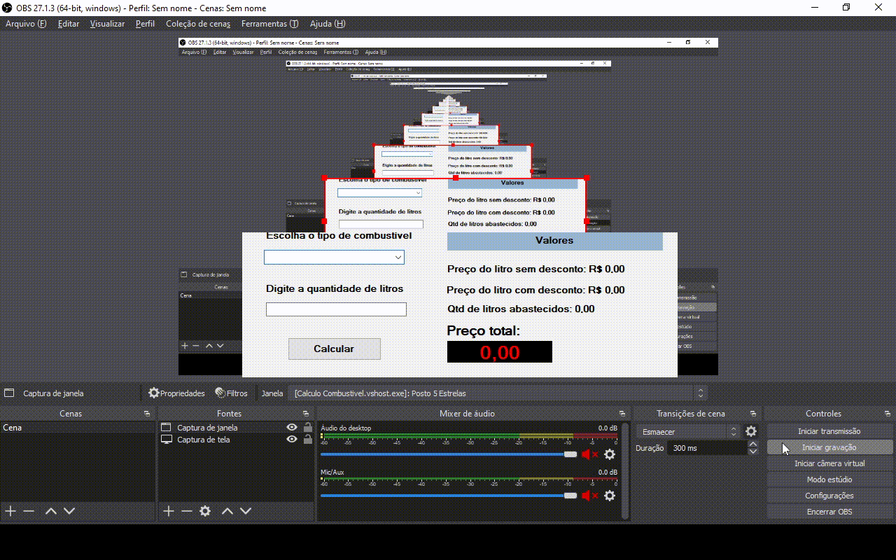

# Cálculo de combustível

Programa simples para calcular o preço total de acordo com o tipo de combustível escolhido e a quantidade de litros digitada. Os tipos de combustíveis disponíveis do programa são:

- Gasolina e Álcool

Com relação ao preço por litro dos tipos de combustíveis defini os seguintes valores:

- Gasolina: R$ 6,29
- Álcool: R$ 5,19

Ao ultrapassar a quantidade de 20 litros abastecido, independente do tipo de combustível selecionado, é aplicado um desconto.

# Vídeo do Projeto

